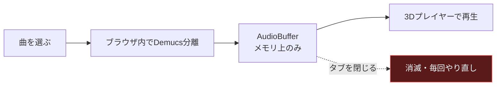
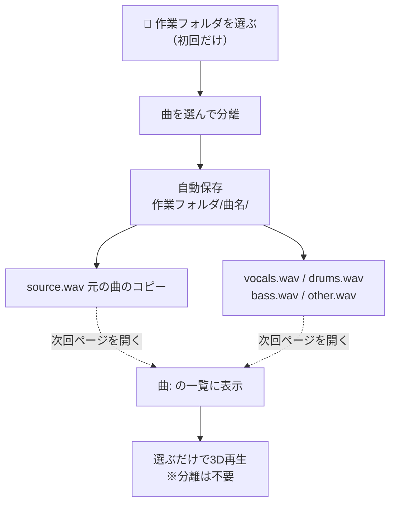

# 分離結果の保存（作業フォルダ）と曲リスト 設計書

**対象**: `d-browser-app`（GitHub Pages で公開しているブラウザ内音源分離アプリ）
**作成日**: 2026-09-06
**背景**: 分離結果は AudioBuffer としてメモリ上にしか存在せず、**タブを閉じると消える**。
数十秒〜数分かけた分離を、聴き直すたびにやり直していた。`CLAUDE.md` §6 TODO の
「端末内保存」を実装する。

---

## 1. 改修前の問題



あわせて、上部の「曲:」セレクタは `library.json`（作者がリポジトリに置く**公開ライブラリ**）
だけを見ており、中身が空のため**常に選択肢ゼロ**で、何のためのUIか分からない状態だった。

## 2. 採用した方式：作業フォルダに直接保存する

利用者に**保存先フォルダを一度だけ選んでもらい**、以後の分離結果はそこへ自動保存する。
次回はそのフォルダを読んで「曲:」に一覧表示し、**分離せずに再生**できるようにする。



保存先フォルダの中身はこうなる。

```
<作業フォルダ>/
├── 曲名A/
│   ├── source.wav      ← 元の曲（そのままコピー）
│   ├── vocals.wav      ← 分離結果（16bit / 44.1kHz）
│   ├── drums.wav
│   ├── bass.wav
│   └── other.wav
└── 曲名B/
    └── …
```

### 採らなかった方式

| 方式 | 採否 | 理由 |
|---|---|---|
| **作業フォルダへ直接保存（File System Access API）** | ✅ 採用 | 保存も読み込みもワンストップ。ユーザーが場所を把握でき、他アプリでも使える。ブラウザのデータを消しても残る |
| ZIPでまとめてダウンロード | ✗ 取りやめ | 展開の手間が増えるだけで、フォルダ保存の利点を消す（ユーザー判断 2026-09-06） |
| 個別ダウンロード | △ フォールバック専用 | Firefox / Safari など File System Access API 非対応ブラウザでのみ使う |
| IndexedDB に保存 | 見送り | ブラウザのサイトデータ削除で消える。ユーザーがファイルとして扱えない |
| サーバーへ保存 | ✗ | 無料・カード無し・著作権の方針（`CLAUDE.md` §3、ユーザー承認済み） |

## 3. 曲リスト（上部「曲:」セレクタ）の再設計

3つの供給源を1つのセレクタに統合し、`<optgroup>` で区別する。

| グループ | 中身 | 出どころ |
|---|---|---|
| 作業フォルダの曲 | 利用者が分離して保存した曲 | 作業フォルダのサブフォルダを走査 |
| 公開ライブラリ | 作者がリポジトリに置いた曲 | `library.json`（現在は空） |

- 選択肢が1つも無いときは「— まだ曲がありません（作業フォルダを選ぶか、曲を分離してください）—」と
  表示して `disabled` にする。**空のまま黙って置かない**（改修前の分かりにくさの原因）。
- パート数を併記する（`曲名（4パート）`）。分離結果が無く元の曲だけのフォルダは `（未分離）` と表示し、
  選ぶと通常再生用に1トラックとして読み込む。

## 4. フォーマットの決定

| 項目 | 決定 | 理由 |
|---|---|---|
| 形式 | **WAV / 16bit PCM / 44.1kHz ステレオ** | ブラウザだけでエンコードでき劣化がない。mp3化はエンコーダ追加が必要で、CDN制約と不具合リスクを負う |
| 量子化 | 32bit float ではなく 16bit | 容量が半分（1分あたり約10MB）。聴取用途には十分 |
| 元の曲 | `source.<元の拡張子>` としてコピー | フォルダだけ見れば元曲も分かる。あとで分離し直せる。名前を固定することでパートと区別できる |
| フォルダ名 | 元ファイル名（記号を `_` に、60文字まで） | 同名が既にあれば `曲名 (2)`、`(3)` … と増やし、**既存データは絶対に上書きしない** |

## 5. メモリ設計（最重要）

2026-08-17 のメモリ最適化で分離時のピークを 436MB → 41MB に下げた。
**保存処理でそれを台無しにしないこと**を最優先の制約とする。

- ❌ してはいけない：曲全体ぶんの `Int16Array` / `ArrayBuffer` を一度に確保する
  （10分の曲なら1トラック105MB、4トラックで420MB）
- ✅ 採用：`wavParts()` を**ジェネレータ**にし、262,144フレーム（約6秒・約1MB）ずつ生成する。
  - 作業フォルダ保存：`FileSystemWritableFileStream.write()` に**そのまま流し込む**。
    JS側にはチャンク1つぶん（約1MB）しか残らない。
  - ダウンロード（フォールバック）：チャンクごとに `Blob` 化して捨て、最後に連結する。
    Blob の実体はブラウザがディスクへ退避するためヒープを圧迫しない。
    1チャンクごとに `await setTimeout(0)` でUIスレッドを明け渡す
    （「ページが応答しません」を出した過去の反省。d37129a 参照）。
- ✅ 元の曲のコピーは `file.stream().pipeTo(writable)` でストリーム転送する。読み切らない。

## 6. 実装箇所

すべて本体HTML（`index.html`。2026-09-06 に `player.html` から改名）内。**外部ライブラリは追加していない**（CDN制約・オフライン動作のため）。

| 追加物 | 場所 | 役割 |
|---|---|---|
| `#workdirCard` | 分離カードの上 | 作業フォルダの選択・解除・再スキャン |
| `#sepSave` パネル | 分離カード内 | 保存結果の表示／フォールバック時のDLボタン |
| `librarySection()` IIFE | 2つ目の `<script>` | 上記すべてのロジック（約450行） |
| `wavParts()` / `wavHeader()` | 同上 | WAVを細切れで生成 |
| `writeWavFile()` / `copySourceFile()` | 同上 | 作業フォルダへストリーム書き込み |
| `scanWorkdir()` / `populateSelect()` / `loadWorkdirSong()` | 同上 | 曲リストの構築と読み込み |
| `window.onSeparationDone()` / `window.resetSavePanel()` | 同上 | 分離モジュールから呼ばれる窓口 |
| `addFilesAsStems()` | プレイヤー本体 | 既存の「＋ 音源ファイルを追加」処理を関数化（フォルダ読み込みと共用） |

**オリジナルの再生・3D処理には手を入れていない**（`CLAUDE.md` §4 の方針を維持）。
`el.fileInput.onchange` は中身を `addFilesAsStems()` として切り出しただけで処理は同一。

### 作業フォルダの記憶（次回も同じフォルダを使う）

`FileSystemDirectoryHandle` を **IndexedDB（`stereophonic-fs` / `handles` / キー `workdir`）に保存**する。
次回ページを開いたときは `queryPermission()` で許可を確認し、

- `granted` → そのまま使う（何も聞かない）
- `prompt` → ボタンを「📂 前回のフォルダを使う（名前）」に変え、**1クリックで許可**を取る
  （ブラウザの仕様上、許可の再取得にはユーザー操作が必須）

### 分離結果はプレイヤーを「置き換える」

`window.addStemsFromAudioBuffers()` は追記ではなく**既存トラックを破棄してから追加**するよう変更した。
リストから曲を選んだあとに別の曲を分離すると、2曲ぶんのトラックが重なって同時に鳴っていたため。

## 7. 異常系の設計

| シナリオ | 対処 |
|---|---|
| 作業フォルダへの書き込み失敗（権限取消・容量不足など） | `❌ 保存に失敗しました: <理由>` を表示し、**その場でダウンロードボタンに切り替える**（分離結果を失わせない）。書きかけのファイルは `writable.abort()` で破棄 |
| 保存先に同名フォルダが既にある | `曲名 (2)`, `(3)` … を作る。既存データは上書きしない |
| ブラウザ再起動で許可が切れる | 「前回のフォルダを使う」ボタンを出し、1クリックで復帰 |
| ユーザーがフォルダ選択をキャンセル | `AbortError` を無視（エラー表示しない） |
| File System Access API 非対応（Firefox / Safari / iOS） | 作業フォルダUIを隠し、**ダウンロード保存＋「📁 フォルダから読み込む」**に自動フォールバック |
| `webkitdirectory` も非対応（iOS Safari） | フォルダ読み込みボタンも隠す。「＋ 音源ファイルを追加」の複数選択で代替できる |
| フォルダに音声が無い / 音声以外が混ざる | 拡張子（wav/mp3/flac/m4a/aac/ogg/opus/webm）で絞り、0件なら警告表示（例外にしない） |
| フォルダ内に複数の曲がある | 曲ごとのボタンを出して選ばせる（勝手に全部読み込まない） |
| 曲名に `/ : * ?` 等が含まれる | `sanitizeName()` で `_` に置換し60文字で切る |
| 書き出し中の多重クリック | `busySaving` フラグでボタンを一括 `disabled` |

## 8. 有識者レビュー（仮想）

- **音響エンジニア視点**: 「16bitに落として良いのか」→ 分離結果は元音源以上の情報を持たず、聴取・
  3D再生用途では差が出ない。容量は半分。ただし**再分離やマスタリング用途には向かない**旨は
  UIで過度に期待させない表現に留めた。元の曲を無劣化でコピーしているため、やり直しは可能。
- **セキュリティ視点**: 「ローカルファイルへの書き込み権限は怖くないか」→ File System Access API は
  **利用者が明示的に選んだフォルダ以外に触れない**。ハンドルは IndexedDB に入るが、
  再訪時は必ず許可確認が入る。UIに「外部に送られない」ことを明記した。
- **フロントエンド視点**: 「非対応ブラウザを切り捨てないか」→ 機能検出で自動フォールバックし、
  非対応でもダウンロード保存とフォルダ読み込みで**同じ往復が成立する**ようにした。
- **UX視点**: 「分離のたびに保存操作をさせるのは負担」→ 作業フォルダがあれば**完全自動保存**にし、
  操作は初回の1回だけにした。

## 9. 既知の制約

- 作業フォルダへの直接保存は **PCのChrome / Edge のみ**（Firefox / Safari / iOS は非対応 → 自動フォールバック）。
- 保存されるのは 16bit WAV。1曲（4分）で元曲＋4パート＝およそ 210MB のディスクを使う。
- 公開ライブラリ（`library.json`）は作者がリポジトリに置く仕組みのままで、
  **利用者がアップロードして共有する機能は無い**（無料・著作権の方針上、意図的に作っていない）。
