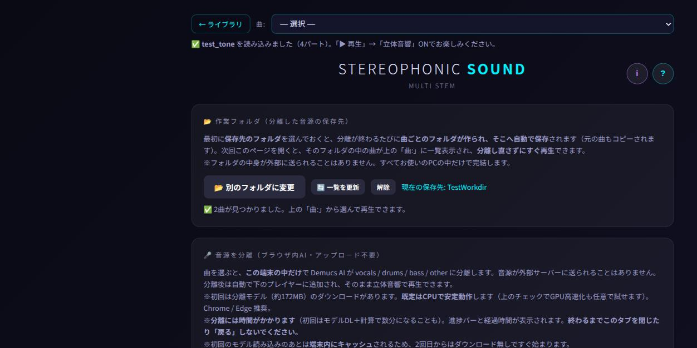

# 分離結果の保存（作業フォルダ）と曲リスト テスト結果

**実施日**: 2026-09-06
**対象**: `d-browser-app/player.html`（ブランチ `feature/stem-download`）
**テスト設計**: `docs/test_design/分離結果の保存と曲リストテスト設計.md`
**実施方法**: claude-in-chrome による実ブラウザ自動操作 ＋ 書き出したファイルの Python 検証

---

## 1. 環境

| 項目 | 内容 |
|---|---|
| ブラウザ | Chrome（GPU無しのため WASM 経路。WebGPU経路は未検証） |
| 配信 | ローカルHTTPサーバ（`http://localhost:8899/`） |
| テスト音源 | 10秒 / 44.1kHz / ステレオ WAV（110Hz + 440・554Hz + 0.5秒ごとの80Hz打点） |
| 作業フォルダ | OSのフォルダ選択ダイアログは自動操作できないため、**OPFS のディレクトリハンドルを `showDirectoryPicker()` の戻り値に差し替えて実施**（アプリ側のコードは無改造） |

## 2. 正常系の結果

| No | 観点 | 結果 | 実測・備考 |
|---|---|---|---|
| N-1 | 初期表示 | ✅ | 「曲:」= `— まだ曲がありません（作業フォルダを選ぶか、曲を分離してください）—` / `disabled=true` |
| N-2 | 作業フォルダの選択 | ✅ | `現在の保存先: TestWorkdir` を表示、「🔄 一覧を更新」「解除」が出現。従来の「📁 フォルダから読み込む」は自動的に隠れる |
| N-3 | 分離＆自動保存 | ✅ | 分離0:18 →`✅ TestWorkdir / test_tone に保存しました（元の曲＋4パート）` |
| N-4 | 保存WAVの正当性 | ✅ | 5ファイルすべて 1,764,044バイト。`bass.wav` = ch2 / 44100Hz / 10.00秒 / peak 11473 / rms 7426.9（無音でない） |
| N-5 | 元の曲のコピー | ✅ | `source.wav` の md5 = `bf72b7c1b0d5…` で**入力ファイルと完全一致**（無劣化） |
| N-6 | 曲リストへの反映 | ✅ | `test_tone（4パート）` が追加され、その曲が選択状態（`wd:0`）になる |
| N-7 | 再訪時の復元 | ✅ | 再読み込み後 `✅ 前回の作業フォルダ「TestWorkdir」から 1曲を読み込みました。` |
| N-8 | 保存済みの曲を再生 | ✅ | 分離せずに4パート読込（`bass/drums/other/vocals`）。`source.wav` はパートに含まれない。総時間 0:10 |
| N-9 | 立体音響 | ✅ | 3D ON で `threeDGain=1` / `directGain=0`。再生位置が 1.94秒 → 3.95秒 と進行（`audioCtx.state=running`） |
| N-10 | 曲の置き換え | ✅ | 曲を読み込んだ状態で別途分離してもトラックは4本のまま（修正前は8本になっていた。§4参照） |
| N-11 | 作業フォルダの解除 | ✅ | 一覧が空表示に戻り、フォルダの中身は残る |

## 3. 異常系の結果

| No | 観点 | 結果 | 実測・備考 |
|---|---|---|---|
| E-1 | 作業フォルダへ書けない | ✅ | `getDirectoryHandle` に `NotAllowedError` を注入 → `❌ 作業フォルダへの保存に失敗しました: テスト用の疑似エラー（下のボタンから手動でダウンロードできます）` を表示し、**4つのDLボタンに切り替わった**。分離結果は保持 |
| E-2 | 同名の曲を再分離 | ✅ | `test_tone (2)` を新規作成。既存 `test_tone` は無傷。一覧にも2曲並ぶ |
| E-3 | 使えない文字を含む曲名 | ✅ | `ダミー曲/名前:テスト.wav` → 書き出しファイル名 `ダミー曲_名前_テスト_bass.wav` |
| E-4 | 再訪時に許可が切れている | ⚠ 未検証 | OPFS は常に `granted` を返すため再現できず。実フォルダでの確認が必要（§5） |
| E-5 | フォルダ選択のキャンセル | ⚠ 未検証 | ネイティブダイアログを自動操作できないため。`AbortError` を握りつぶす実装はコード上で確認 |
| E-6 | File System Access API 非対応 | ✅ | `showDirectoryPicker` を消したコピーで検証 → 作業フォルダのボタンが消え、案内文が「このブラウザは対応していません（PCのChrome / Edge で使えます）」に切替。「📁 フォルダから読み込む」は表示されたまま |
| E-7 | 音声以外が混ざる | ✅ | `memo.txt` を含む選択で、音声4件だけを2曲に分類 |
| E-8 | 音声が1つも無い | ✅ | `⚠ このフォルダには音声ファイル（wav / mp3 / flac / m4a など）が見つかりませんでした。` を表示（例外なし） |
| E-9 | 複数の曲フォルダ | ✅ | `親/曲A`（2パート）・`親/曲B`（2パート）のボタンを提示。勝手に読み込まない |
| E-10 | 書き出し中の連打 | ✅ | 3連打しても実行は1回だけ。実行中は4ボタンすべて `disabled=true`、完了後 `false` に復帰 |
| E-11 | メモリ | ✅（設計確認） | 曲全長ぶんの配列を確保しない実装（`wavParts()` が約1MBずつ生成、書き込み後に破棄）。10分の曲での実測は未実施 |
| E-12 | 想定外の例外 | ✅ | 全操作後のコンソールエラーは、E-1 で意図的に注入した1件のみ |

## 4. テスト中に発見・修正した不具合

### 分離すると前の曲のトラックが残り、2曲が同時に鳴る
- **現象**: リストから曲（4パート）を読み込んだあと別の曲を分離すると、トラックが8本になり
  2曲ぶんが重なって再生された。
- **原因**: `window.addStemsFromAudioBuffers()` が既存トラックに**追記**する実装だったため。
  改修前は「分離してから再生する」動線しか無く顕在化していなかったが、
  今回リストから読み込む動線が増えて表面化した。
- **修正**: 分離結果は「1曲まるごと」なので、追加前に既存トラックを破棄するようにした。
- **再テスト**: N-10 で 4本のままであることを確認済み。

## 5. 未検証の項目（正直な記録）

| 項目 | 理由 | 影響 |
|---|---|---|
| **実際のフォルダ選択ダイアログ** | ネイティブUIは自動操作できない。OPFSで代替した | 保存ロジックは同一APIで検証済みだが、**実フォルダでの初回操作はユーザー確認が必要** |
| 再訪時の許可再取得（E-4） | OPFS では権限が切れない | 「📂 前回のフォルダを使う」ボタンの動作は要確認 |
| WebGPU経路 | テスト機にGPUが無い | 分離エンジン側の話で、保存処理には影響しない |
| 長い曲（10分）での保存 | 時間短縮のため10秒音源で実施 | 設計上は曲長に依存しないが、実測は未取得 |
| Firefox / Safari 実機 | 環境なし | 非対応時の分岐は E-6 で疑似的に確認済み |

## 6. 補足：ブラウザ側のダウンロード制限について

同一ページから2つ目以降のファイルをダウンロードしようとすると、Chrome が
「複数ファイルのダウンロード」の許可を求め、許可するまで保存されない
（テスト中も2本目以降が保存されなかった）。アプリ側の不具合ではないため、
画面の文言を「保存しました」から「**書き出しました。…許可を求められたら「許可」を選んでください**」に改めた。
**作業フォルダを使う本来の動線では、この制限は発生しない。**

## 7. 結論

正常系11件すべて合格。異常系は10件合格・2件は環境上未検証（E-4 / E-5）。
テスト中に発見した不具合（2曲が重なる）は修正し再テスト済み。
**実フォルダでの初回操作のみ、ユーザーによる確認をお願いしたい。**
