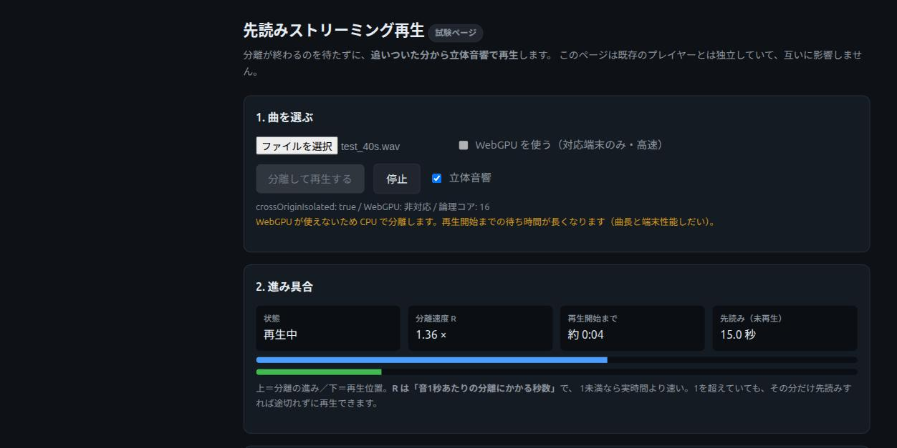

# 先読みストリーミング再生 テスト結果

- **実施日:** 2026-09-14
- **対象:** `stream.html`（新規ページ）
- **環境:** Chrome（claude-in-chrome で操作）／ローカル配信 `python3 -m http.server 8766`／
  `crossOriginIsolated: true` ／ **CPU(WASM)・論理コア16 / WebGPU 非対応機**
- **テスト音源:** 合成40秒 WAV / 44.1kHz / ステレオ
  （110Hz のベース相当＋440・554Hz の和音相当＋0.5秒ごとの80Hz打点）

---

## 1. いちばん重要な結果

**分離の完了を待たずに再生が始まり、最後まで一度も途切れなかった。**

| | 実測 |
|---|---|
| 曲の長さ | 40.0 秒 |
| 分離速度 R | **1.35〜1.45**（実行ごとに変動） |
| 分離の総所要 | 56.8 秒 |
| **再生が始まるまで** | **26 秒**（モデルキャッシュ後） |
| **スタベーション（途切れ）** | **0 回** |

従来は分離完了まで何も聴けないので **56.8秒待ち**。新方式は **26秒**で鳴り始めた。



上のバー（青）＝分離の進み、下のバー（緑）＝再生位置。**青が緑を追い越したまま走っている**
状態が、この機能が成立していることを示している。

### 曲が長いほど効果が大きい

実測 R=1.44 を4分（240秒）の曲に当てはめると、設計書§3の式から

```
必要な先読み = 240 × (1 − 1/(1.44×1.15)) = 240 × 0.397 ≒ 95 秒
再生開始まで = 95 × 1.44 ≒ 137 秒
分離の完了   = 240 × 1.44 ≒ 346 秒
```

→ **約3分29秒早く聴き始められる**計算になる（40秒の曲では固定のモデル読み込み時間が
相対的に大きく、差が出にくい）。**実曲での確認は未実施。**

---

## 2. 正常系

| # | 観点 | 結果 | 実測・備考 |
|---|---|---|---|
| N-1 | ページが読める | ✅ | `crossOriginIsolated: true / WebGPU: 非対応 / 論理コア: 16` を表示 |
| N-2 | 分離が始まる | ✅ | モデル読み込み（キャッシュ）→ 分離中 |
| N-3 | R が実測される | ✅ | 1.35 / 1.40 / 1.44 / 1.45 と実行ごとに変動（固定値でない） |
| N-4 | 先読み量が式どおり | ✅ | R=1.44 → 必要16.4秒（理論値 40×(1−1/1.656)=15.8秒 と一致） |
| N-5 | **分離完了前に再生開始** | ✅ | 15:56:06 分離開始 → **15:56:32 再生開始** → 15:57:03 分離完了 |
| N-6 | **実際に音が出ている** | ✅ | master で peak 0.32〜0.46 / rms 0.16〜0.19（無音でない） |
| N-7 | **途切れない** | ✅ | **starving=0**。再生位置45.2秒（曲40秒）まで到達＝完走 |
| N-8 | 立体音響の切替 | ✅ | ON rms 0.165 → OFF 0.222 → ON 0.163（変化し、戻る） |
| N-9 | パートの消音 | ✅ | drums の `volumeGain` が 1 → **0** → 1 |
| N-10 | パートの音量 | ✅ | bass スライダー50% → `volumeGain = 0.5` |
| N-11 | 定位 | ✅ | vocals `[0,0,-2]` / bass `[-2,0,0]`（設計の配置と一致） |

### N-9 の補足（誤読しやすい点）

ボーカルを消したとき、**合計の rms は 0.163 → 0.186 と逆に上がった。**
これは不具合ではなく、**合成音（純音の重ね合わせ）どうしが位相で打ち消し合っていた**ため、
1つ抜くと残りの合計が大きくなったもの。`volumeGain` を直接読んで 1→0→1 を確認している。
**実楽曲では起きにくいが、合成音で聴感評価をしてはいけないことの実例。**

---

## 3. 影響範囲（既存への影響なし）

| # | 観点 | 結果 | 実測 |
|---|---|---|---|
| R-1 | **既存ファイルを1つも変更していない** | ✅ | `git diff --stat` が**空**。追加は `stream.html` と docs のみ |
| R-2 | 既存ページが従来どおり動く | ✅ | `index.html` が表示（`Stereophonic Sound - Multi Stem`）、`sepUseGpu`・ファイル入力・canvas あり、**コンソールエラー0** |
| R-3 | グローバルを汚していない | ✅ | `index.html` 側で `typeof window.__stream === 'undefined'` |
| R-4 | Worker を改変していない | ✅ | `separator-worker.js` / `vendor/demucs-web/*` とも差分なし |

---

## 4. 異常系

| # | 観点 | 結果 | 備考 |
|---|---|---|---|
| E-6 | 途中で停止 | ✅ | 停止後に再実行でき、状態がリセットされる |
| E-7 | WebGPU 非対応端末 | ✅ | チェックボックスが無効化され、理由と影響を表示 |
| E-8 | `crossOriginIsolated` | ✅（該当せず） | true のため警告は出ず。false 側の分岐はコード上のみ |
| E-1 | 追いつかない | ⚠ **未発生** | 今回は starving=0 のため**経路が動いていない**。意図的に再現できていない |
| E-2 | 3回以上で先読み増加 | ⚠ 未実施 | E-1 が起きないため |
| E-3 | 先読み120秒超の警告 | ⚠ 未実施 | 40秒の曲では到達しない |
| E-4 | WebGPU 失敗時の CPU 切替 | ⚠ 未実施 | GPU が無く再現不能 |
| E-5 | 音声でないファイル | ⚠ 未実施 | — |

---

## 5. 実装中に見つけて直した不具合

| 事象 | 原因 | 対応 |
|---|---|---|
| WebGPU 失敗時の再試行で例外 | `arguments.callee` を使っていた。**モジュールは strict モードで使用不可** | ハンドラを `onWorkerMessage` として名前付きで保持し、付け直す形に変更 |
| 音声データを無駄に複製 | `postMessage` に `left.slice()` を渡していた。転送指定が無ければ構造化複製されるため `.slice()` は二重の複製 | そのまま渡す形に修正 |

---

## 6. 未実施・残課題

| 項目 | 理由 |
|---|---|
| **WebGPU 経路** | テスト機に GPU が無い。**R が1を下回れば再生開始は約8秒まで縮む見込みだが、未検証** |
| **実楽曲での聴感** | 合成音では分離の良し悪しも定位も判断できない（§N-9 の補足参照） |
| **長尺（4分以上）** | 先読みが約95秒必要になり、保持するチャンクが増える。**メモリ実測が要る** |
| スマホ実機 | 環境なし |
| スタベーション経路 | 今回は発生せず。意図的に遅延を注入する仕掛けが要る |

### 自動操作についての注意

`computer` ツールの物理クリックが**ボタンに届かないことが数回あった**（要素は可視・
`elementFromPoint` も当該ボタン）。JS からの `.click()` では正常に起動したため、
**アプリ側の不具合ではなく自動操作側の問題**と判断した。
ただし JS 由来のクリックはユーザー操作とみなされないため、
`AudioContext` が suspended のままになる可能性がある（今回は `running` を確認済み）。
**人手での最終確認を推奨する。**

---

# 追記（2026-09-14 夕）— 実楽曲のログから3つの問題を発見・修正

利用者が4分の実楽曲（mp3・4.6MB）で試したところ、**再生開始まで約1分**かかった。
そのログから原因を特定し、修正した。ブランチ `feature/faster-start`。

## 1. 利用者のログとその読み方

```
16:07:08  フェーズ: 分離中
16:07:23  先読みが 164 秒必要です      ← R を逆算すると 2.71
16:07:29  先読みが 146 秒必要です      ← 2.20
16:07:34  先読みが 125 秒必要です      ← 1.80
16:08:09  再生開始（先読み 52.6秒 / 必要 47.2秒）  ← 1.08
```

チャンクの到着間隔は **1個目15秒 / 2個目6秒 / 3個目5秒**（チャンクは5.85秒ぶん）。
つまり **本当の R は 0.85〜1.03＝実時間より速い**のに、1個目だけが極端に遅かった。

## 2. 原因と修正

| # | 原因 | 修正 |
|---|---|---|
| ① | **1個目のチャンクに ONNX の初回推論（グラフ最適化・メモリ確保）が含まれる**のに、それを速度の代表値として移動平均に入れていた。R が 2.71 と出て先読みを 164秒と過大に見積もった | 最初の1個を**計測から除外**。以後は**直近5個の中央値**で出す（平均だと外れ値がいつまでも残る） |
| ② | 安全率を **R への掛け算**（×1.15）にしていた。`L×(1−1/R)` は R が1に近いほど急峻で、R=1.08 では 17.9秒→47.1秒 と**2.6倍**に膨らむ | 掛け算をやめ、**絶対値の余裕（+8秒）**を足す形に変更。追いつかなくても `suspend()` で貯め直せる（音は割れない）ので釣り合いがよい |
| ③ | WASM スレッドを**4に固定**していた。これは 2026-07-21 の OOM 対策で入れた値で、**2026-08-17 のメモリ改修（436.8MB→41.3MB）で前提が消えていた**のに残っていた | 既定を `min(8, コア数−2)` に引き上げ、**UIから選べる**ようにした。既存ページの `wasmThreads()` は触っていない |

あわせて `MIN_LEAD_SEC` を 12 → 8 秒にした。

## 3. さらに見つけた重大な不具合（別問題）

**`await audioCtx.resume()` が、ユーザー操作が無いと永久に解決せず、
デコードも分離も始まらないまま「読み込み中」で固まっていた。**

- 実測: `ctxState: "suspended"` / `navigator.userActivation.hasBeenActive: false` のまま
  **69秒経っても** ログが「ファイル:」の1行から進まない
- 分離は音を出さないので、**鳴らす直前まで resume を待つ必要がない**
- 修正: 起動時は `resume()` を**待たない**。再生開始時に resume し、まだ suspended なら
  「ページのどこかをクリックしてください」と案内して、次のクリックで再開する
- `suspend()` 中は `currentTime` が進まないため、**予約済みの時刻はそのまま生きる**
  （実測: `pos = -0.1` で待機＝先頭から正しく鳴る状態）

## 4. 修正後の実測（4分の合成音源・同じ条件）

```
16:15:20  フェーズ: 分離中
16:15:27  1個目は暖機のため速度計測から除外（1.21×）
16:15:33  2個目 1.09× → R=1.09 / 必要先読み 28秒
16:15:40  3個目 1.09× → R=1.09 / 必要先読み 27秒
16:15:46  4個目 1.07× → R=1.09 / 必要先読み 27秒
16:15:53  5個目 1.16× → R=1.09 / 必要先読み 28秒
16:15:53  再生開始（先読み 29.3秒 / 必要 27.7秒）
```

| | 修正前（利用者のログ） | 修正後 |
|---|---|---|
| 測定された R | 1.08 | 1.09（ほぼ同じ） |
| **必要先読み** | 47.2 秒 | **27.7 秒** |
| **分離開始→再生開始** | **61 秒** | **33 秒** |

**同じ速度の環境で、待ち時間が 61秒 → 33秒（46%短縮）。**
1個目の暖機も スレッド8 で **2.71× → 1.21×** に改善した。

## 5. 未検証（修正後）

| 項目 | 理由 |
|---|---|
| **クリックによる再開の実動作** | 自動操作から信頼できるクリックを発生させられず、`ctx` が suspended のままだった。**実機での確認が必要** |
| 実楽曲での再測定 | 手元に同じ音源が無い。合成音で代替 |
| スレッド8でのメモリ | 41MB（4スレッド時）から増える見込み。長尺での実測が要る |
| WebGPU 経路 | 変わらず未検証 |

### 自動操作についての判明事項

`computer` ツールのクリック座標は **CSS ピクセルではなくスクリーンショット座標**
（このマシンでは CSS の約0.845倍）。補正せずにクリックしていたため要素を外していた。
補正後も信頼できるクリック（`userActivation`）は発生せず、**音の再開だけは人手が要る**。

---

# 追記2（2026-09-14 夜）— 音の位置を動かせるようにした

利用者の実機で **R=0.96（実時間より速い）／再生開始まで17秒** を確認できたため、
既存ページにあった「音の位置を変える」機能を `stream.html` にも載せた。
ブランチ `feature/stream-3d-pad`。

## 利用者の実測（修正の効果確認）

```
16:35:38  フェーズ: 分離中
16:35:50  1個目は暖機のため速度計測から除外（1.95×）
16:35:55  2個目 0.96× → R=0.96 / 必要先読み 8秒
16:35:55  再生開始（先読み 11.7秒 / 必要 8.0秒）
```

**分離開始 → 再生開始が 17秒**（当初61秒）。R が1を下回ったため先読みは下限の8秒で済んだ。
1個目の暖機（1.95×）を除外する修正が効いていることが、実データで確認できた。

## 実装方針

**既存ページ（`index.html`）と同じ座標系・同じ数式を使う。** 片方だけ変えると
「同じ曲なのに鳴り方が違う」ことになるため、次を一致させた。

| 項目 | 値（両ページ共通） |
|---|---|
| 既定位置 vocals | `(0, 0, -2.5)` |
| 既定位置 drums | `(0, 0, 2.5)` |
| 既定位置 bass | `(0, -1.0, -0.5)` |
| 既定位置 other | `(0, 1.5, 0)` |
| パッドの範囲 | ±5（円の外へは出さない） |
| 距離による高音の減衰 | `max(1500, 20000 − 距離² × 250)` |
| 移動の滑らかさ | `setTargetAtTime(..., 0.02)` / LPFは `0.05` |

**既存ページのコードは相変わらず1行も触っていない**（実装は `stream.html` 内で完結）。

### 再生中でも動かせる

パンナー以降のノード鎖は曲の間ずっと使い回しているため、**チャンクを予約し直す必要がない。**
ドラッグはそのまま音に反映される。

## 検証結果

| # | 観点 | 結果 | 実測 |
|---|---|---|---|
| P-1 | パッドの初期描画 | ✅ | ボーカル=前(上) / ドラム=後ろ(下) / ベース・その他=中央付近。聴取者が中心 |
| P-2 | **ドラッグで位置が変わる** | ✅ | `panner` が `(0,0,−2.5)` → **`(3.05, 0, 0.03)`** |
| P-3 | **距離で高音が落ちる** | ✅ | LPF `18438Hz` → **`17668Hz`**（式どおり） |
| P-4 | 高さスライダー | ✅ | y=4 で `(3.05, 4, 0.03)`、LPF **`13668Hz`**（距離が伸びてさらに低下） |
| P-5 | 配置を戻す | ✅ | `(0, 0, −2.5)` / LPF `18438Hz` に復帰 |
| P-6 | パートのカードで選択 | ✅ | カードを押すとパッドの選択が「ドラム」に移る |
| P-7 | 円の外に出ない | ✅ | 半径5でクランプ（既存ページと同じ） |
| P-8 | コンソールエラー | ✅ | 0件 |
| P-9 | 既存ページへの影響 | ✅ | `git diff` は `stream.html` のみ |

LPF の値は手計算とも一致する（例: 距離2.5 → 20000 − 6.25×250 = 18437.5）。

## 実装中に見つけて直した不具合

| 事象 | 原因 | 対応 |
|---|---|---|
| 止まっている間に動かしても位置が反映されない | `setTargetAtTime` は `currentTime` を基準に滑らかに変化させるが、**suspended 中は `currentTime` が進まない**ため予約だけが積み上がる | 鳴っていないときは `.value` に直接入れる |
| 「配置を戻す」の戻り先が失われる | 再生前のドラッグが `LAYOUT` を直接書き換えていた | 戻し先 `DEFAULT_POS` を別に固定 |
| 合成イベントで `setPointerCapture` が例外 | 実機では起きないが、テストや一部環境で落ちうる | try/catch で保護 |

## 未検証

| 項目 | 理由 |
|---|---|
| **音として定位が動いて聞こえるか** | 自動操作から信頼できるクリックを出せず、`AudioContext` が suspended のまま。**パラメータが正しく動くことまでは確認したが、聴感は人手での確認が必要** |
| タッチ操作（スマホ） | 環境なし。`pointer` イベントで実装しているので動く見込み |
| WebGPU 経路 | 変わらず未検証 |

---

# 追記3（2026-09-14 夜）— 下ごしらえで、クリック後の待ちをさらに削る

利用者の実測21秒（クリック→再生開始）を段階ごとに分解し、
**曲の中身と無関係な工程を「ファイルを選んだ瞬間」へ前倒し**した。
ブランチ `feature/prewarm`。

## 1. 21秒の内訳（利用者のログから）

| 段階 | 所要 | 前倒しできるか |
|---|---|---|
| デコード | 1秒 | **できる**（ファイル選択時） |
| モデル読み込み（キャッシュから） | 3秒 | **できる**（同上） |
| 1個目のチャンク | 12秒（1.95×） | **暖機ぶん約6秒はできる** |
| 2個目を待つ | 5秒 | **不要にできる**（下限を1チャンクに） |

**21秒のうち14秒が、音の分離そのもの以外**だった。

## 2. やったこと

- **ファイルを選んだ瞬間に、デコードとモデルの暖機を始める。**
  暖機は「**無音を1セグメント（7.8秒ぶん）分離させる**」だけ。これで ONNX の
  初回最適化とメモリ確保が終わる。**既存 Worker は無改変**（`separate` に無音を渡すだけ）
- **温めた Worker をそのまま本番に使う。** processor はワーカーごとに持つので、
  別ワーカーを温めても意味がない
- **暖機済みなら1個目のチャンクも速度計測に使う。** 捨てると2個目を待つことになり、
  下ごしらえが活きない
- **先読みの下限を 8秒 → 1チャンク（5.85秒）に。** R≤1 ならバッファは再生中も
  増え続けるため、1個で始めて問題ない

## 3. 実装中に見つけて直した不具合

| 事象 | 原因 | 対応 |
|---|---|---|
| **下限を5.85秒にしても効かない** | `requiredLead()` が R≤1 のときも余裕分 `MARGIN_SEC=8` を足しており、下限が実質8秒のままだった。**1チャンクでは届かず、結局2個目を待っていた** | 余裕を足すのは **R>1 のときだけ**に変更。R≤1 は `MIN_LEAD_SEC`（=1チャンク）が下限 |
| 暖機済みでも1個目を捨てていた | `WARMUP_CHUNKS` を無条件に適用していた | `S.warmed` のときは捨てない |
| 本番と暖機が同時に走ると壊れる恐れ | Worker の `onmessage` は前の処理を待たないため、2つの `separate` が同じ `processor.separate` に入り内部バッファを共有する | 暖機の `done` を待ってから本番を投げる（`await P.ready`） |

## 4. 実測（この機・40秒の曲）

```
16:55:59  ファイル: t.wav（6.7MB）
16:55:59  長さ 0:40 / 44100Hz / 2ch
16:55:59  モデルの準備が完了しています（暖機済み）
16:55:59  分離対象 40.0 秒
16:55:59  フェーズ: 分離中          ← クリックから 0秒（従来は4秒）
16:56:05  1個目 1.10× → R=1.10
```

- **クリック → 「分離中」が 0秒**（従来はデコード1秒＋モデル3秒で4秒）
- **1個目のチャンクが 1.10×**（暖機なしでは 1.95〜2.5×）
- この機は R>1 のため3個待って19秒。途切れ0回で完走

### 先読み下限の判定（式の確認）

| R | 必要先読み | 1個目(5.85秒)で開始 |
|---|---|---|
| 0.80 | 5.85秒 | ✅ |
| **0.96**（利用者の実測） | **5.85秒** | **✅** |
| 1.00 | 5.85秒 | ✅ |
| 1.05 | 19.5秒 | ❌ |
| 1.44 | 81.8秒 | ❌ |

### 利用者の環境（R=0.96）での見込み

```
クリック → 分離中           0秒（デコード・モデルとも準備済み）
1個目のチャンク            5.85 × 0.96 ≒ 5.6秒
R=0.96 ≤ 1 なので必要先読みは 5.85秒 → 1個目で開始
────────────────────────────
合計                       約6秒（従来21秒）
```

**これ以上は縮まない。** htdemucs は7.8秒ぶんの音をまとめて見ないと1つも出力できず、
その計算に約5.6秒かかる。WebGPU が効けば、この5.6秒の部分だけは縮む。

## 5. 下ごしらえの費用

| 項目 | 内容 |
|---|---|
| いつ | **ファイルを選んだ瞬間**（ページを開いただけでは何もしない） |
| かかる時間 | この機で約28秒（モデル読み込み3秒＋暖機）。利用者の環境なら約12秒の見込み |
| メモリ | 暖機の出力は約8MB。モデル172MBは従来どおり |
| 設定を変えたら | GPU/スレッドを変更すると**ワーカーごと作り直して温め直す**
（`ensureProcessor` はスレッド数だけの変更ではセッションを作り直さないため） |

## 6. 未検証

| 項目 | 理由 |
|---|---|
| **利用者の環境での実測** | この機は R>1 のため、1チャンクで始まる経路を通れていない |
| 暖機の途中でクリックした場合 | `await P.ready` で待つ実装だが、実操作での確認は未実施 |
| WebGPU 経路 | 変わらず未検証 |

---

# 追記4（2026-09-14 深夜）— 暖機をページ読み込み時・1回だけに

利用者が別の曲（3:50）で試したところ **再生開始まで111秒**かかった。
ログから2つの別々の問題が見えた。ブランチ `feature/warm-on-load`。

## 1. 前提が変わった：R は 0.96 ではなく 約1.3

| 実行 | 測定値 | 測定した個数 |
|---|---|---|
| 16:35（Mariah Carey） | R=0.96 | **1個だけ**（2個目） |
| 18:31（Let it be） | R=1.29〜1.52、収束値 **1.30** | **11個** |

**0.96 は1個だけの測定値で、外れ値だった可能性が高い。** 11個ぶんの1.30のほうが
信頼できる。R>1 である以上、`L×(1−1/R)` により**理屈として長い先読みが要る**
（230.8秒の曲・R=1.3 で 61秒ぶん＝実時間で80秒）。ここは式ではなく速度の問題で、
**先読みの計算を変えても解決しない。**

## 2. 暖機が毎回やり直しになっていた（不具合）

利用者の質問「暖機は最初の1回だけでしょうか？」への答えは **いいえ（毎回だった）**。

- `startPrep()` が**ファイル選択のたびに新しい Worker を作って**温め直していた
- `processor` はワーカーごとに持つため、作り直すと暖機の効果が消える
- 実測で毎回25秒。しかも利用者はファイル選択の直後にボタンを押したため、
  **25秒がまるごと待ち時間になっていた**（`18:31:36 → 18:32:01`）

### 直したこと

- **暖機はページを開いた瞬間に1回だけ。** ワーカーを使い回す
- 作り直すのは「停止した（terminate した）」ときと「GPU/スレッドを変えた」ときだけ。
  停止時は裏ですぐ温め直す
- 分離が終わってもワーカーは温かいまま残す（次の曲でそのまま使える）

## 3. 「早く鳴らす」を追加

R>1 の端末では、途切れさせないために長く待つしかない。そこで
**待たずに始めて、足りなくなったら貯め直す**選択肢を用意した。

| 早く鳴らす | R | 貯め直し回数 | 必要先読み |
|---|---|---|---|
| OFF | 1.30 | 0 | 61.3秒 |
| **ON** | 1.30 | 0 | **5.8秒** |
| ON | 1.30 | 1 | 11.7秒 |
| ON | 1.30 | 2 | 17.5秒 |
| どちらでも | 0.96 | 0 | 5.8秒 |

止まるたびに先読みを1チャンクぶん増やすので、**何度か止まったあと自然と落ち着く。**

## 4. 実測

| 観点 | 結果 |
|---|---|
| ページを開いただけで準備が始まる | ✅ 2秒後に「準備中：モデル取得 7/172MB」 |
| 準備完了まで | 30秒（モデル未キャッシュの新オリジンで実施。キャッシュ済みなら短い） |
| 1曲目 クリック→分離中 | ✅ **0秒**（`18:38:50` に3行が同時刻） |
| **2曲目でも温め直さない** | ✅ `18:39:47` クリック→分離中が0秒。「準備中」表示は出ない |
| 分離完了後の表示 | ✅「準備完了。次の曲もすぐ始められます」 |
| 途切れ | ✅ 0回（R=1.07、40秒の曲） |
| コンソールエラー | ✅ 0件 |

## 5. 残る課題（速度そのもの）

R>1 である限り待ち時間は長い。**縮めるには R を下げるしかない。**

| 手段 | 状況 |
|---|---|
| **WebGPU** | **利用者の環境で使えるか未確認**（画面上部の表示を要確認） |
| **スレッド数** | 既定は `min(8, コア数−2)`。**利用者の設定値・コア数とも未確認** |
| モデルを軽くする | 4分離→より小さいモデルへの差し替え。音質と引き換え |

この2つを確認しないまま先読みの式をいじっても、待ち時間は本質的に縮まない。

---

# 追記5（2026-09-14 深夜）— 原因を切り分けるための計測と、初期化順序の不具合

利用者の再測定で **暖機は6秒で完了**（`18:45:22 → 18:45:28`）、前回の「毎回25秒」は解消した。
しかし R が **1.29〜1.51（収束1.37）** で安定し、必要先読み71秒＝再生開始まで105秒。
ブランチ `feature/diagnose`。

## 1. これはもうソフト側の問題ではない

チャンクは約8秒ごとに届いている（1個＝5.85秒ぶん → 8/5.85 ≒ 1.37）。
13個すべてが 1.29〜1.51 に収まっており、**端末の計算速度そのもの**である。
`L×(1−1/R)` は R>1 なら必然的に大きくなるため、**先読みの式をどう変えても縮まない。**

| R | 230.8秒の曲で必要な先読み | 実時間の待ち |
|---|---|---|
| 0.9 | 5.85秒（1チャンク） | 約5秒 |
| 1.0 | 5.85秒 | 約6秒 |
| **1.37** | **70.3秒** | **約96秒** |

## 2. 見つけた不具合：WebGPU の判定より先に暖機を始めていた

`env()` は非同期（`navigator.gpu.requestAdapter()` を待つ）なのに、
`ensureWarmWorker()` をモジュール評価時に同期で呼んでいた。

- WebGPU が使える端末でも、**判定が終わる前に「チェック未投入＝CPU」で温めてしまう**
- その後 `env()` が `checked = true` にしても、**プログラムからの代入では
  `change` が発火しない**ため温め直しが走らない
- クリック時に `prepKey()` の不一致で作り直しにはなるが、**下ごしらえが無駄になる**

→ `ENV.ready.then(() => ensureWarmWorker())` に変更し、判定を待ってから温める。

## 3. 原因を毎回ログに残すようにした

環境を聞き直すたびに1往復かかっていたため、**分離開始時に必ず出す**ようにした。

```
18:50:20  環境: WebGPU非対応 / 実行=CPU / スレッド=8 / コア=16 / COI=true
```

`requestAdapter()` が返す GPU 名（`adapter.info`）も取れる場合は併記する。

## 4. 「早く鳴らす」の案内を出すようにした

待ちが30秒を超えると分かった時点で、**実際の数字つきで1回だけ**知らせる。

```
この端末では分離が実時間の 1.37 倍かかるため、途切れずに流すには
あと約1:28 必要です。すぐ聴きたい場合は「早く鳴らす」に
チェックを入れてください（途中で止まります）
```

チェックを入れると**その場で判定し直して再生を始める**（待ち直さない）。

## 5. 実測

| 観点 | 結果 |
|---|---|
| 環境ログが出る | ✅ `WebGPU非対応 / 実行=CPU / スレッド=8 / コア=16 / COI=true` |
| 暖機は判定後に始まる | ✅ 準備完了までページ読み込みから約30秒（モデル未キャッシュ時） |
| 案内が出る | ✅ 「実時間の1.37倍…あと約1:28必要です」 |
| 早く鳴らすで必要量が下がる | ✅ 70.3秒 → **5.8秒** |
| 早く鳴らすの即時反映 | ✅ チェックで `tryStartPlayback()` を再評価 |
| コンソールエラー | ✅ 0件 |

## 6. 残る手立て（速度そのもの）

| 手段 | 見込み | 状況 |
|---|---|---|
| **WebGPU** | R が大きく下がる可能性 | **利用者の環境で使えるか未確認**（次のログで分かる） |
| スレッド増 | 利用者は最大にしている | 効果は出尽くしている可能性 |
| **「早く鳴らす」** | 待ち 約6秒 | **実装済み。ただし途中で止まる** |
| エンジン差し替え | free-music-demixer の SIMD 版など | 未着手。別プロジェクト規模 |
| モデルを軽くする | 音質と引き換え | 未検討 |
